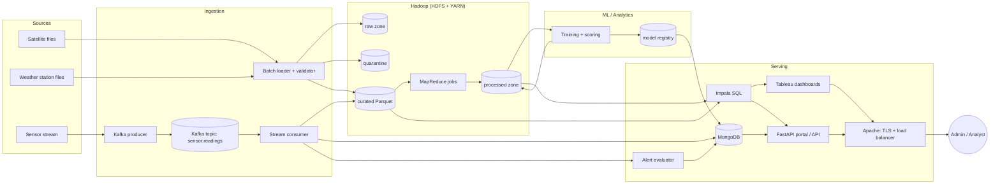
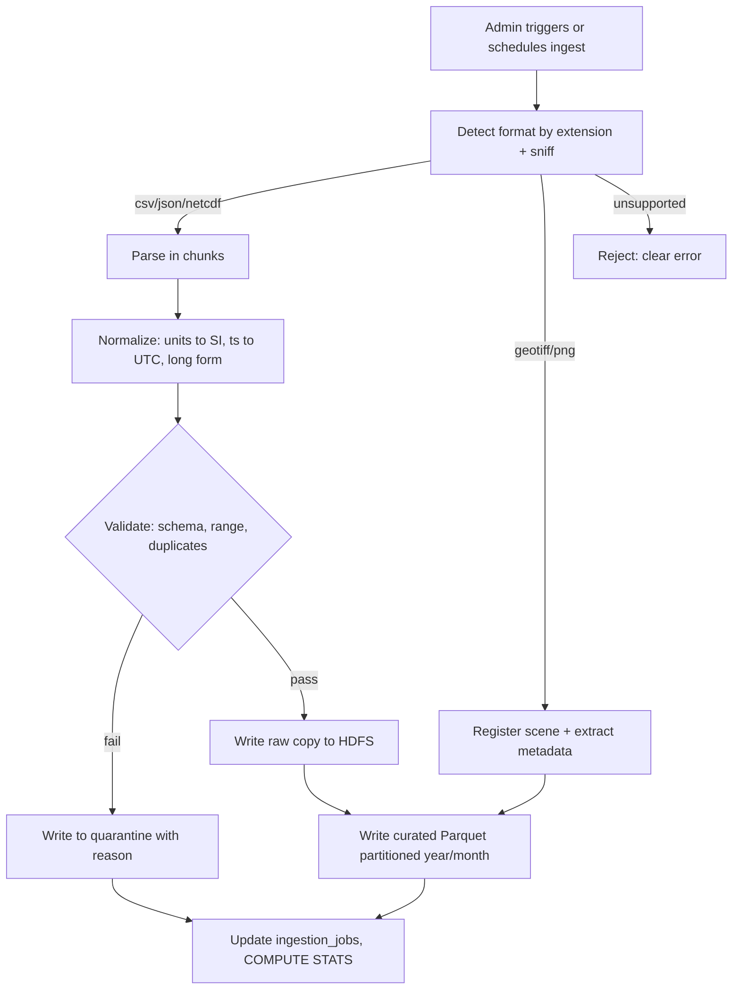
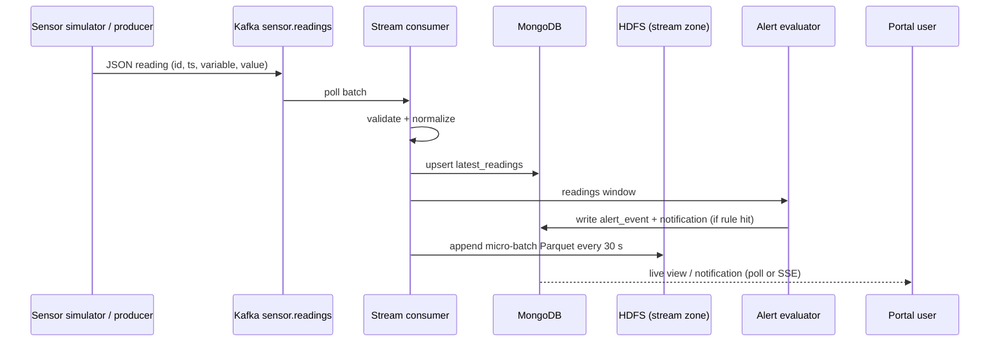
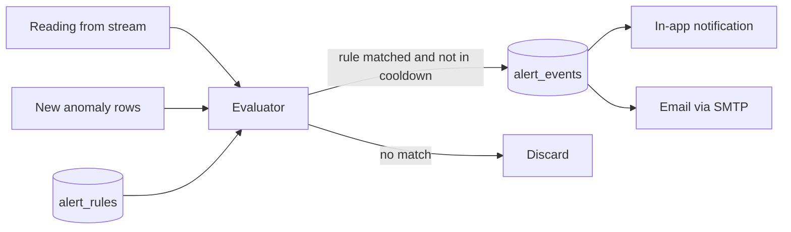
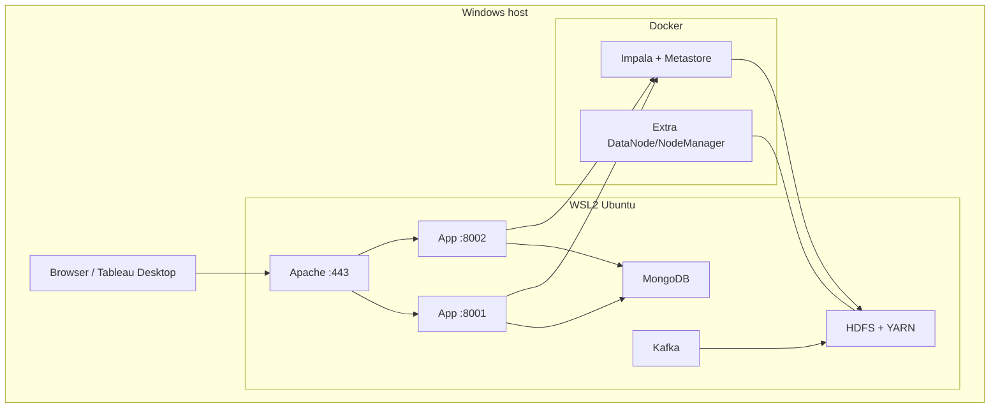
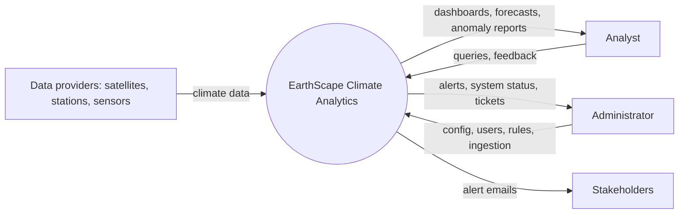
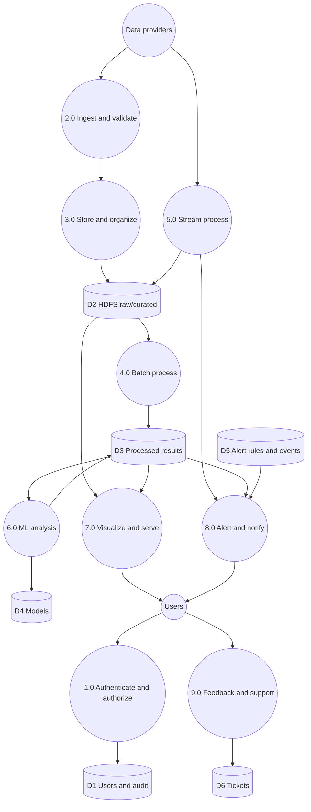

# design.md — EarthScape Climate Analytics

How the system in `spec.md` is built. Diagrams use Mermaid (render in VS Code, GitHub, or paste into mermaid.live for the report).

---

## 1. Architecture overview

A **lambda-style** architecture: a batch layer (HDFS + MapReduce) for completeness and history, a speed layer (Kafka + consumer) for low latency, and a serving layer (Impala + MongoDB + web portal) that unifies both.



### Component responsibilities

| Component | Responsibility | Spec |
|---|---|---|
| Batch loader | Read files, validate, normalize units/timestamps, write raw copy + curated Parquet, quarantine bad rows | FR-2, FR-3 |
| Kafka + stream consumer | Real-time sensor ingest; micro-batch write to HDFS every 30 s; push latest readings to Mongo; feed alert evaluator | FR-5 |
| MapReduce jobs | Parallel aggregation, climatology, anomaly scoring, correlation inputs | FR-4 |
| ML module | Train/evaluate/score models; register versions | FR-6 |
| Impala | SQL over curated + processed Parquet; unified batch ∪ stream view | FR-3.4, FR-5.2 |
| MongoDB | Operational data: users, rules, alerts, tickets, audit log, job + model metadata, latest readings | FR-1, 8, 9 |
| Alert evaluator | Evaluate rules against stream and fresh anomaly results; notify | FR-8 |
| FastAPI portal | Auth, RBAC, REST API, pages, embeds dashboards | FR-1, 7, 9 |
| Apache | TLS termination, reverse proxy, load balancing across app instances | NFR-3, NFR-8 |
| Tableau | Analyst dashboards from Impala / extracts | FR-7.4 |

---

## 2. Environment and versions (pin in `docs/ASSUMPTIONS.md`)

| Item | Choice |
|---|---|
| Host | Windows 10/11, i5/i7, 16 GB RAM, 500 GB SSD |
| Runtime for big data stack | WSL2 Ubuntu 22.04 |
| Hadoop | 3.3.x, pseudo-distributed (NameNode, DataNode, ResourceManager, NodeManager), replication = 1 locally (documented; 3 in a real cluster) |
| Extra node for scaling demo | Second DataNode/NodeManager in Docker Compose |
| Kafka | 3.x single broker (KRaft mode, no ZooKeeper) |
| Impala | Docker quickstart (Impala + Hive Metastore) pointed at HDFS; fallback Hive/Spark SQL (A-7) |
| MongoDB | 7.x, plus Compass and `mongosh` |
| Python | 3.11 (Anaconda env `earthscape`) |
| Web | FastAPI, Uvicorn, Jinja2, Plotly, bcrypt, PyJWT |
| Proxy | Apache HTTP Server 2.4 (mod_ssl, mod_proxy, mod_proxy_balancer) |

Memory plan for 16 GB: HDFS+YARN ≈ 4 GB, Kafka ≈ 1 GB, Mongo ≈ 1 GB, Impala+HMS ≈ 4 GB, app + OS ≈ rest. Start only what a task needs.

---

## 3. Storage design

### 3.1 HDFS layout

```
/climate
├── raw/                                   # immutable originals
│   ├── weather/source=ghcn/ingest_date=YYYY-MM-DD/<file>
│   ├── sensor/source=<sensor_net>/ingest_date=YYYY-MM-DD/<file>
│   └── satellite/source=<sat>/year=YYYY/month=MM/<scene files>
├── curated/                               # validated, normalized Parquet
│   ├── weather_observations/year=YYYY/month=MM/*.parquet
│   ├── sensor_readings/year=YYYY/month=MM/day=DD/*.parquet
│   └── satellite_metadata/year=YYYY/month=MM/*.parquet
├── processed/                             # MapReduce + ML outputs
│   ├── monthly_stats/ climatology/ anomalies/ correlations/ forecasts/
├── models/                                # serialized models (joblib) by version
├── quarantine/<source>/<ingest_date>/     # rejected rows + reason
└── backups/                               # snapshots / distcp targets
```

Decisions: raw is never modified (reprocessable); curated is columnar + snappy; partition on `year`/`month` because most queries are time-bounded; stream data uses an extra `day` level so micro-batch files stay small and compactable.

### 3.2 Canonical observation schema (curated)

`weather_observations` and `sensor_readings` share one long-form shape so batch and stream union cleanly:

| Column | Type | Notes |
|---|---|---|
| `source_id` | string | Station or sensor ID |
| `source_type` | string | `station` / `sensor` |
| `ts_utc` | timestamp | ISO 8601, UTC |
| `variable` | string | `temp_c`, `precip_mm`, `humidity_pct`, `pressure_hpa`, `co2_ppm`, `pm25_ugm3`, `sea_level_mm`, … |
| `value` | double | SI units |
| `unit_original` | string | Unit as received |
| `lat`, `lon`, `elevation_m` | double | From station/sensor registry |
| `region` | string | Derived (country/zone) |
| `quality_flag` | string | `ok` / `imputed` / `suspect` / `missing` |
| `ingest_id` | string | Links to `ingestion_jobs` |
| `year`, `month` | int | Partition columns |

Dedupe key: `(source_id, ts_utc, variable)`.

### 3.3 Impala tables / views

| Object | Type | Source |
|---|---|---|
| `observations_batch` | external, partitioned | curated weather + sensor files |
| `observations_stream` | external, partitioned | stream micro-batches |
| `observations` | **view** | `batch ∪ stream`, deduped on key, stream rows win ties |
| `satellite_metadata` | external | curated satellite metadata |
| `monthly_stats` | external | MapReduce output |
| `climatology` | external | per `source_id, variable, month_of_year`: mean, stddev, n |
| `anomalies` | external | `source_id, ts_utc, variable, value, z_score, method, model_version` |
| `correlations` | external | `var_a, var_b, region, window, pearson, spearman, p_value, n` |
| `forecasts` | external | `variable, region, target_ts, yhat, lower, upper, model_version` |

`COMPUTE STATS` is run after each load/job (NFR-2).

### 3.4 MongoDB collections

| Collection | Key fields | Notes |
|---|---|---|
| `users` | `_id`, `email` (unique), `password_hash`, `role`, `scopes[]`, `active`, `failed_attempts`, `locked_until`, `created_at` | bcrypt |
| `audit_log` | `ts`, `user_id`, `action`, `target`, `ip`, `details` | Append-only |
| `ingestion_jobs` | `source`, `type` (batch/stream), `status`, `started`, `ended`, `rows_in/out/rejected`, `error` | FR-2.7 |
| `alert_rules` | `name`, `variable`, `region`, `operator`, `threshold`, `type` (value/anomaly), `consecutive`, `severity`, `cooldown_s`, `recipients[]`, `enabled` | FR-8.2 |
| `alert_events` | `rule_id`, `ts`, `source_id`, `value`, `severity`, `status`, `acked_by` | FR-8.4 |
| `notifications` | `user_id`, `event_id`, `channel`, `sent_at`, `read` | In-app + email log |
| `latest_readings` | `source_id`, `variable`, `ts`, `value` (capped/TTL 24 h) | Powers live views |
| `feedback_tickets` | `user_id`, `type`, `subject`, `message`, `status`, `replies[]`, `created_at` | FR-9 |
| `model_registry` | `name`, `version`, `trained_at`, `train_window`, `metrics`, `hdfs_path`, `active` | FR-6.4 |
| `metrics` | `ts`, `name`, `value`, `tags` (TTL 30 d) | NFR-1 |
| `saved_views` | `user_id`, `dashboard`, `filters` | FR-7.3 |

---

## 4. Ingestion design

### 4.1 Batch



Validation rules (configurable in `ingestion/rules.yaml`): physically plausible ranges per variable (e.g. `temp_c` −90…60, `humidity_pct` 0…100, `pressure_hpa` 800…1100), required fields present, timestamp parseable and not in the future, duplicates dropped.

Idempotency: re-running a file with the same content hash is a no-op (hash stored in `ingestion_jobs`).

### 4.2 Streaming



Consumer is at-least-once; dedupe key makes the unified view effectively exactly-once. Late data (< 1 h) is accepted; older goes to quarantine with reason `late`.

---

## 5. Processing design (MapReduce via Hadoop Streaming)

Every job: input = curated Parquet exported to text via a thin reader step (or curated TSV mirror for jobs), mapper/reducer in Python, output to `/climate/processed/<job>/run=<ts>/`. Each job has `run.sh`, a local test, and a README.

| Job | Mapper emits | Reducer computes | Output |
|---|---|---|---|
| `monthly_avg` | key `(source_id, variable, yyyy-mm)` → `(value, 1)` | mean, min, max, stddev, count, missing_count (combiner for sum/count) | `monthly_stats` |
| `climatology` | key `(source_id, variable, month_of_year)` over a baseline period | long-term mean and stddev | `climatology` |
| `anomaly` | join observation with climatology via distributed cache (small side) | `z = (x − μ) / σ`; flags \|z\| ≥ threshold | `anomalies` |
| `correlation_prep` | key `(region, yyyy-mm)` → `(variable, value)` | pivot to aligned monthly pairs and running sums for Pearson (n, Σx, Σy, Σxy, Σx², Σy²) | `correlation_inputs` → finalised in `ml/correlate.py` |
| `quality_report` | key `(source_id, variable)` → status flags | counts of ok / imputed / suspect / missing | quality table for the report |

Missing-data policy (FR-4.3): rows with null `value` are counted and skipped in aggregates; single-reading gaps are linearly interpolated and flagged `imputed`; gaps longer than the configured window are left missing and reported. Malformed lines increment a Hadoop **counter** (`BAD_RECORD`) rather than failing the task.

Optimization (NFR-2): combiners, `-D mapreduce.job.reduces` tuned, Parquet column pruning at export, partition pruning by date range. Record timing for CSV vs Parquet in the report.

---

## 6. Machine learning design

| Model | Algorithm | Input | Output | Evaluation |
|---|---|---|---|---|
| Anomaly detection | Isolation Forest (+ z-score baseline from MapReduce) | Per station/variable features: value, rolling mean/std, seasonal residual | `anomalies` with score and flag | Precision/recall/F1 on injected anomalies; compare against pure z-score |
| Trend prediction | Seasonal decomposition + linear trend; SARIMAX or Prophet-like fallback via statsmodels | Monthly mean series per region/variable | `forecasts` with 80% / 95% intervals | MAE, RMSE, MAPE on last N months vs naive seasonal baseline |
| Correlation analysis | Pearson + Spearman with p-values; lagged correlation (0…12 months) | Monthly aligned pairs | `correlations` | Report effect size and `n`; flag n < 30 as low confidence |

Lifecycle (FR-6.4): `ml.train_*` reads the latest curated/processed data from Impala, trains, evaluates, saves a joblib artifact to `/climate/models/<name>/<version>/`, registers metrics in `model_registry`, and promotes to `active` only if metrics beat the current model (or admin forces). Scheduled weekly (cron/Task Scheduler) and triggerable from the admin page. Each model gets a short **model card** in `docs/models/` (purpose, data, metrics, limits).

---

## 7. Alerting design



- Rule types: **value** (`variable op threshold` for a region/station) and **anomaly** (`z ≥ k` for `m` consecutive readings).
- Cooldown per `(rule, source_id)` prevents alert storms. Severity: info / warning / critical.
- Rules are cached in memory and refreshed on a short interval or on change event, so admin edits apply without restart.
- Delivery target: in-app within 10 s of the triggering reading (FR-8.3).

---

## 8. Web portal and API design

### 8.1 Security model

- Login → server verifies bcrypt hash → issues JWT (access, 30 min) in an httpOnly, Secure, SameSite=Lax cookie. CSRF token on forms.
- `Depends(require_role("admin"))` / `require_scope("weather")` on every route. Deny by default.
- Rate-limit login; lock after 5 failures for 15 min.
- Input validation with Pydantic; output never includes `password_hash`.
- Audit log written by a middleware/helper for sensitive actions.

### 8.2 REST endpoints (`/api/v1`)

| Method & path | Role | Purpose |
|---|---|---|
| `POST /auth/login`, `POST /auth/logout` | public / any | Session |
| `GET /me` | any | Current user and scopes |
| `GET/POST/PATCH /users`, `POST /users/{id}/reset-password` | admin | User management |
| `GET /datasets`, `GET /datasets/{name}/schema` | analyst+ | Browse available data (scope-filtered) |
| `GET /observations?variable&source&from&to&agg` | analyst+ | Query via Impala (parameterized, scope-checked, row-limited) |
| `GET /stats/monthly`, `GET /climatology` | analyst+ | Processed results |
| `GET /anomalies?from&to&region&min_z` | analyst+ | Anomaly list |
| `GET /forecasts?variable&region` | analyst+ | Forecast with bands |
| `GET /correlations?region&window` | analyst+ | Correlation matrix |
| `GET /live/readings`, `GET /live/stream` (SSE) | analyst+ | Latest values / push updates |
| `POST /ingest/upload`, `POST /ingest/trigger`, `GET /ingest/jobs` | admin | Ingestion control |
| `GET/POST/PATCH/DELETE /alerts/rules` | admin | Rule configuration |
| `GET /alerts/events`, `POST /alerts/events/{id}/ack` | analyst+ | Alert history, acknowledge |
| `GET /notifications`, `POST /notifications/{id}/read` | any | In-app notifications |
| `POST /feedback`, `GET /feedback/mine` | any | Submit/track tickets |
| `GET/PATCH /feedback`, `POST /feedback/{id}/reply` | admin | Ticket handling |
| `POST /models/{name}/retrain`, `GET /models` | admin | ML lifecycle |
| `GET /admin/metrics`, `GET /admin/audit` | admin | Monitoring + audit |
| `GET /health` | public (minimal) | Uptime checks |

### 8.3 Pages

Login · Overview dashboard · Anomalies · Forecasts · Correlations · Live view · Alerts + rules (admin edit) · Support/feedback · Admin: Users, Ingestion, Models, Monitoring, Audit · Help (user guide/FAQ).

Dashboards (FR-7): Tableau workbooks for Overview/Anomalies/Forecast embedded via iframe (extracts if live Impala can't be embedded); Plotly pages for Live view and anything needing real-time refresh. Filters shared: date range, region/station, variable.

---

## 9. Non-functional design

| NFR | Design |
|---|---|
| NFR-1 Monitoring | `ops/monitor.py` polls NameNode/ResourceManager REST (`/jmx`, `/ws/v1/cluster/apps`), Kafka consumer lag, API latency middleware → `metrics` collection → admin Monitoring page; Hadoop web UIs linked |
| NFR-2 Optimization | Parquet+snappy, partition pruning, combiners, `COMPUTE STATS`, benchmark table in report |
| NFR-3 Security | TLS at Apache (self-signed cert for demo, documented), bcrypt, HDFS encryption zone for `/climate/curated/sensitive` (KMS) or documented equivalent, secrets in env, field-level encryption (AES-GCM) for user PII in Mongo |
| NFR-4 Compliance | Control mapping table in `docs/compliance.md`: minimization, access control, audit, retention (TTL), breach procedure |
| NFR-5 Uptime | `/health` + external check every minute → `metrics`; uptime % computed in the Monitoring page; maintenance banner config |
| NFR-6 Backup | `ops/backup.sh`: HDFS snapshots + `distcp` of `/climate/curated`, `/climate/processed`, `/climate/models`; `mongodump`; retention 7 daily / 4 weekly; restore drill documented |
| NFR-7 Scale-out | Add DataNode/NodeManager container, run `hdfs balancer`, show more concurrent map tasks |
| NFR-8 Load balancing | Apache `mod_proxy_balancer` (byrequests) over two Uvicorn instances (ports 8001/8002), health-checked; stateless JWT sessions make this safe |
| NFR-9/10 Standards | CF conventions for NetCDF read/write, ISO 8601, SI units, documented naming; idempotent jobs, quality counters, lineage via `ingest_id` |

Deployment topology (demo):



---

## 10. Data flow diagrams (for the report)

### DFD Level 0 (context)



### DFD Level 1



Activity flowcharts for the report: ingestion (section 4.1), alert evaluation (section 7), login/RBAC check, model retraining. Mermaid sources are kept in `docs/diagrams/` and exported to PNG for the report.

---

## 11. Testing strategy

| Level | What | Tooling |
|---|---|---|
| Unit | Validators, unit conversion, z-score, rule evaluator, RBAC dependencies | pytest |
| Job | Each MapReduce job locally via pipe, then on YARN with the sample set; compare to pandas reference result | pytest + shell |
| Integration | File → HDFS → Impala query returns expected counts; stream → alert in < 10 s | pytest + scripts |
| Security | Role matrix test (every route × role), lockout, token expiry, SQL/NoSQL injection attempts on query params | pytest |
| ML | Metrics thresholds vs baseline; reproducibility via fixed seeds | pytest |
| Non-functional | Throughput at 5/50 msgs/s, uptime log, backup/restore drill, node-add demo | scripts + notes |
| Acceptance | Walk each `spec.md` acceptance criterion; record pass/fail in `docs/test-report.md` | manual + evidence screenshots |

Test data (`data/test/`): clean sample, broken-rows file, out-of-range file, duplicates file, late-data file, injected-anomaly stream script.

---

## 12. Key design decisions and trade-offs

| Decision | Why | Trade-off |
|---|---|---|
| Hadoop Streaming (Python) instead of Java MapReduce | Faster to build and test; fits team skills | Slightly lower raw performance |
| Kafka + Python consumer instead of Spark Streaming | Fits 16 GB RAM; simpler to explain | Less rich stream API; windowing hand-written |
| Parquet curated zone, raw immutable | Reprocessing and fast scans | Extra storage |
| MongoDB for operational data | Flexible schema for rules/tickets; listed in brief's tools | Not suited for analytics, so analytics stays in HDFS/Impala |
| JWT cookie sessions | Stateless, works with load balancer | Needs short expiry + CSRF care |
| Tableau for BI + Plotly for live | Meets brief's tool list while keeping real-time views possible | Two visualization stacks to maintain |
| Single-machine cluster | Hardware reality | Scaling and fault tolerance demonstrated, not proven at scale (documented, A-1) |

## 13. Open questions (resolve and record in `docs/ASSUMPTIONS.md`)

1. Which exact public datasets and regions to focus on (suggest one country/region plus global CO₂)?
2. Is Tableau Desktop/Public available for the student, and is embedding vs linking acceptable for the "dashboard" requirement?
3. Does Aptech expect the "Website" to be live-hosted, or is a local demo + video enough?
4. Is Impala mandatory for marking, or is Hive acceptable if setup fails?
